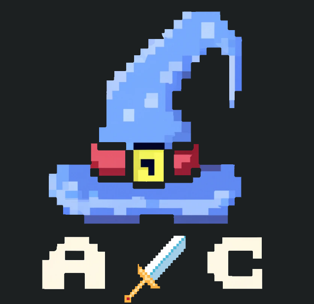
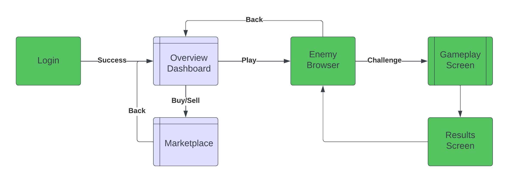
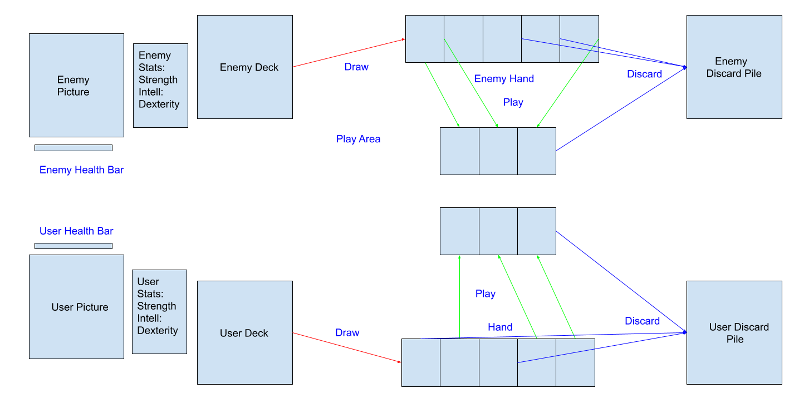
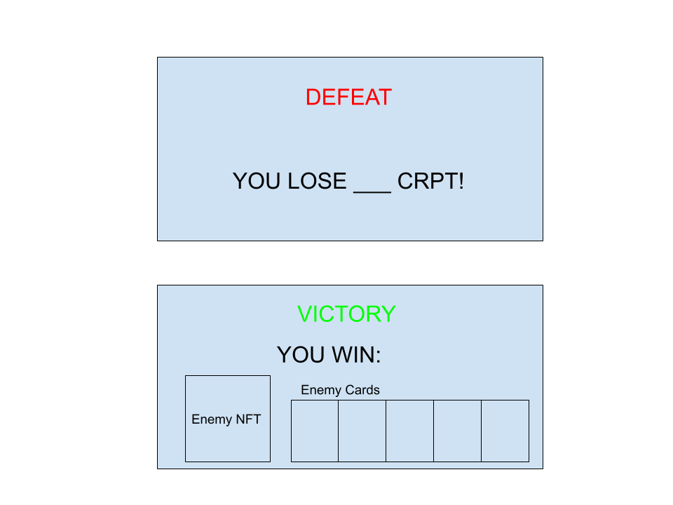
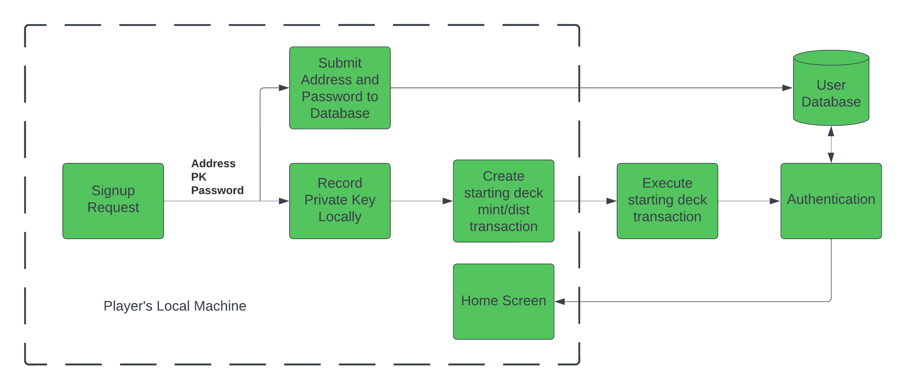
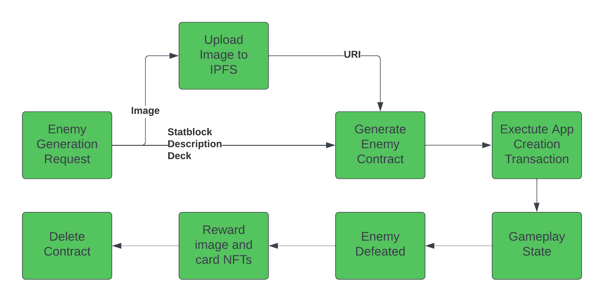
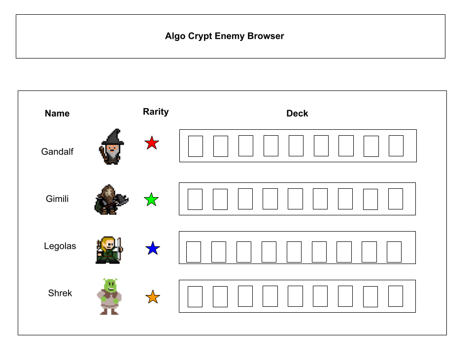
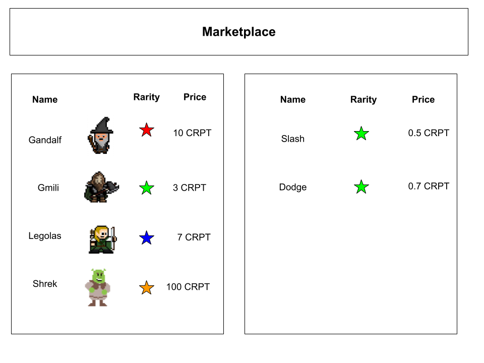

# Algo Crypt

A Massively-Multiplayer Online Trading Card Game on the Algorand Blockchain

# Overview

The blockchain hosts a bounty list of AI-generated enemies. Players build a deck of NFT cards to challenge them in a card game to the death. Players browse the list and select enemies to hunt, with the first player to defeat an enemy rewarded with an NFT representation of the defeated enemy as well as a random selection of cards from that enemy’s deck. Players can trade enemy and card NFTs on an associated marketplace, collecting cards to use in PvE or PvP battles. Cards and enemies will have associated rarities and varying values.

The AI component includes use of GPT-3 to generate stat blocks for enemies (strength, intelligence, dexterity) from a thematic prompt. Then, the stat block and theme are passed to DallE to generate an image to represent that stat block. 

The blockchain component runs on Algorand. All cards and enemies are represented as NFTs using Algorand standard assets. The blockchain also validates games and winnings as a ledger of games and actions. The card and enemy marketplace will run on this blockchain as well using the CRPT asset. The use of blockchain also allows for validation of physical games with the introduction of a smart playmat and physical cards in a future project.

# Instructions

## Install

## Run API

## Create Account

## Challenge an Enemy

## How to Play

## Browse Marketplace

# Technology Stack

## Technologies
- GPT3
- DallE
- Algorand
## Frameworks
- FastAPI
- Postgres DB
## Library dependencies
- PyGame
- PyTeal


# Project Structure

```
- root
    - algo_crypt
        - game
        - contracts
        - api
        - marketplace
        - asset_generation
```

# Project Management (To-Do List)

- Gameplay/Playmat
  - Draw out structure
  - Make initial playmat with no functionality
  - Add game engine to playmat
  - Link game engine and UX
- Enemy Generation
  - Design background story and enemy description
  - Generate stat blocks 
    - strength, intelligence, dexterity, and unique ability
  - Generate unique images
- NFT minting and exchange
  - Scripts (priority order)
    - Player Generation
      - Player opt-in on sign-up
      - Minting and distribution of starting deck
    - Enemy contract
      - Generation
          - Minting of enemy deck
          - Image NFT
            - Upload to IPFS
            - Mint/Distribute NFT
      - Enemy Defeat
        - Random selection and reward of enemy cards to player
        - Reward of image NFT
- User Experience (game outside of playmat)
    - Signup and Login
    - Card Management Interface 
# System Design

## Overview



The project consists of the following subsections:


## Gameplay





New users will have 30 basic cards to start the game. After entering a battle with an enemy,
you will have 5 cards in hand (5 is the upper limit for cards in hand). You and the enemy will take turns to play cards. On each turn, you can only play up to three cards, the rest will go to discard pile (after you run out of cards in hand and deck, your discard pile will be shuffled so that you can keep using these cards.) The player and the enemy will each have 30 health points (HP). The aim of the game is to make you enemy's HP become 0 before he defeats you. After one player played one to three cards, it will become the other player's turn, and he should react to previous cards, and play his cards. When a player is out of cards in hand, deck, and discard pile, he is going to lose HP on each turn incrementally (-1 hp, -2 hp, ...). Challengers will always play first. 

Each card consists of an ability(attack, block, dodge). Attack and block cards have physical and magical properties. One's attack and block is scaled by their strength and intelligence properties respectively. An enemy with more strength will have greater physical attacks and blocks while an enemy with more intelligence will have greater magical attacks and blocks. The attack value will become direct damage toward a player; in this case, the player can play block cards to decrease the damage or use dodge cards to avoid the attack. 

## NFT Minting and Distribution

Card or enemy NFTs will be minted and/or distributed at the following stages.

### Account Creation



Whenever a player creates a new account, the account receives a basic deck to their collection in the form of a set number of basic cards. Each of these cards must be generated as an asset with the unit name "CRPTCARD" and a descriptive asset name corresponding to the name of the card. The minting and distribution of these cards will be combined in an atomic transaction ensuring invalid NFTs do not leak into the supply.

### Enemy Creation



When enemies are created, they will gain a pre-determined deck of cards similar to player account creation. However, the deck of cards will be supplied to the enemy creation script and designed by a developer. Each of the generated cards will have corresponding NFTs of the same "CRPTCARD" unit name which are then placed in escrow in the smart contract that corresponds to that enemy. When the enemy is defeated, a subset of those cards are randomly selected to reward to the victorious player, and the rest are deleted.

In addition to the cards, the enemy's image will be generated, uploaded to IPFS, and minted as an NFT before being placed in escrow in the smart contract. This NFT and a subset of that enemy's deck will then be awarded to the victorious player when the enemy is defeated. The enemy's contract will include a separate game state for every active challenge, and games will be played on-chain with transactions submitted to the enemy contracts.

## Enemy Generation

A text based stat block and character background is generated from GPT3 based on a parmaterized prompt. The stat block is passed into DALE in order to generate a visual representation. The stat block and images are then combined to make the enemy card. Initially, these cards will be text-only. However, in the future



## NFT Marketplace

NFT marketplace for cards and defeated enemies (including rarities, value, etc).



### Types of Cards
- Basic
- Common
- Uncommon
- Rare
- Mystic
- Legendary

# Future Projects

The virtual game can be incorporated onto a physical playmat through RFID chips in the playmat and cards. This would allow for the physical game to be played for real stakes. 

Reinforcement learning for enemy moves to create more adaptive and challenging enemy playstyles

The storage of enemies and NFTs in escrow contracts means that larger enemies could be introduced to be fought by multiple players at once. The enemy NFTs rewarded could then be shared using Algorand's fractional NFTs.

Allow a player vs. player arena where players can wager and challenge other players.

# Developers

Joseph Xiao, RPI, xiaoj6@rpi.edu

Shawn George, RPI, georgs2@rpi.edu

Luke Williams, RPI, willil14@rpi.edu

Yichen Zhao, RPI, zhaoy17@rpi.edu